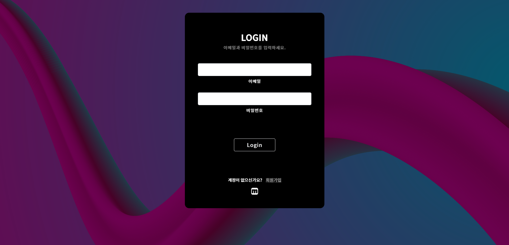
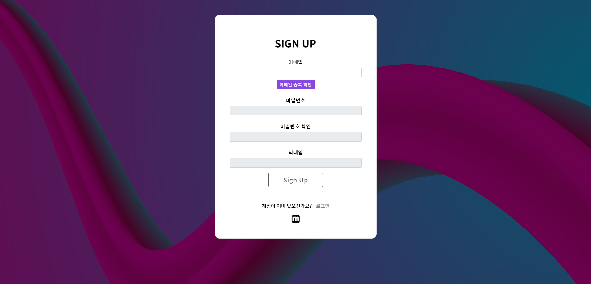
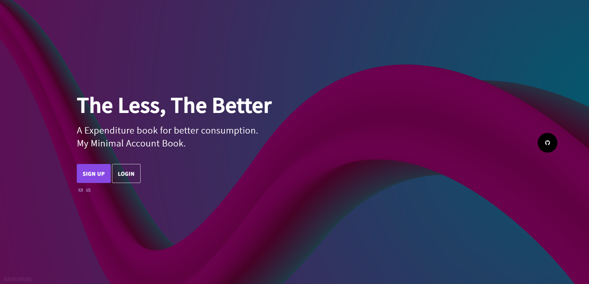
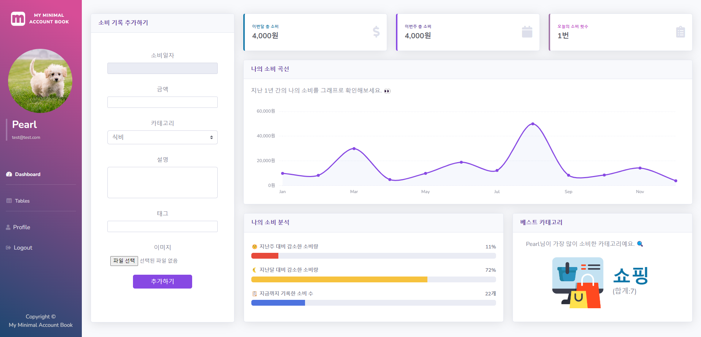
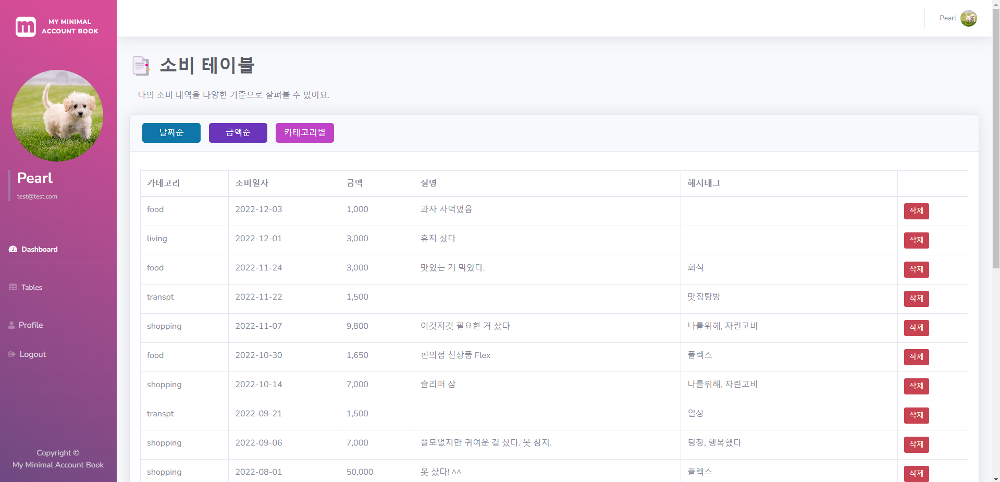
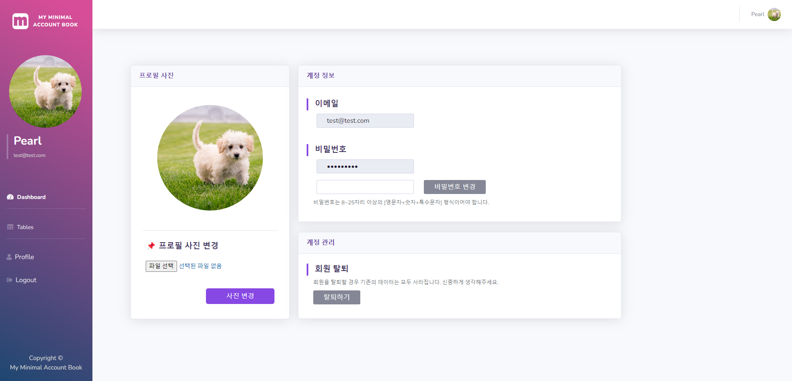
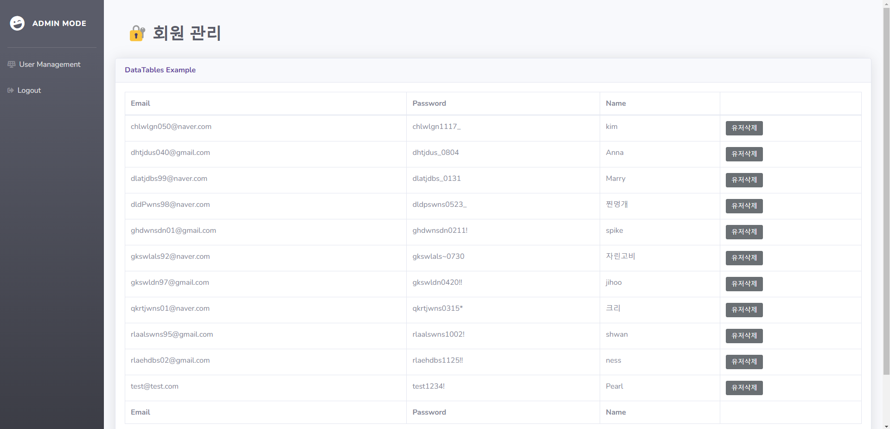
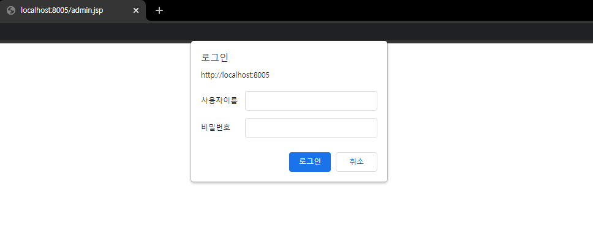

# [2022-2] 지능웹설계 프로젝트
## 💸 My Minimal Account Book 📑

- __프로젝트명__ : __My Minimal Account Book__
- __프로젝트 기간__ : 2022.11.17 ~ 2022.12.03 (2 weeks)
- __프로젝트 도구__
    
Language : Java, css, html, javascript
    
Server : Apache Tomcat
    
Framework : BootStrap
    
DBMS : MySQL
    
IDE : Intellij
---
## 대표 기능
### 1. Index
#### 1) 로그인/회원가입

#### 2) 영어 지원

### 2. Main
#### 1) 대시보드
데이터 작성, 데이터 분석 기능 

#### 2) 테이블
해당 유저가 작성한 데이터 조회 기능 

### 3) 프로필
프로필 사진, 비밀번호 변경, 회원 탈퇴 기능 

### 3. Admin Mode
회원 조회, 삭제 기능 

- 인덱스 페이지의 좌측 하단의 링크를 통해 접근 가능 
  
- 서버에 등록된 로그인 정보와 일치할 경우에만 접근 승인 
  
---
## 폴더 트리
### 1. src - Java의 servlet class
    dao : 데이터베이스와 관련된 작업을 수행하는 모듈
    dto : 웹페이지에 필요한 데이터 형식
    utility : 그 외 작업에 필요한 모듈

### 2. web : Web root 폴더
    WEB-INF : 프레임워크 등의 환경설정 파일
    resources : 이미지, 폰트, css, sql 파일와 같은 웹 자원
    signup : 회원가입 관련 모듈
    login : 로그인 관련 모듈
    util : 레이아웃을 구성하는 컴포넌트 & 작업 처리 모듈
---
## 사용법

1. 로컬 저장소에 본 프로젝트를 복사한다.

   - git bash 사용 시 다음 명령어 입력 
     `git clone https://github.com/Ness731/JSP_webProject.git`

2. 복사한 프로젝트에 서버를 등록한다.

3. src/dao/DBUtil.java에서 MySQL 정보를 입력하여 데이터베이스를 연동한다. 

   `static String user = "";`
   `static String password = "";`
   `static String url = "";`
---
### 주의사항
디렉토리 구조를 임의로 변경할 경우 __리소스 접근에 오류가 발생할 수 있음.__